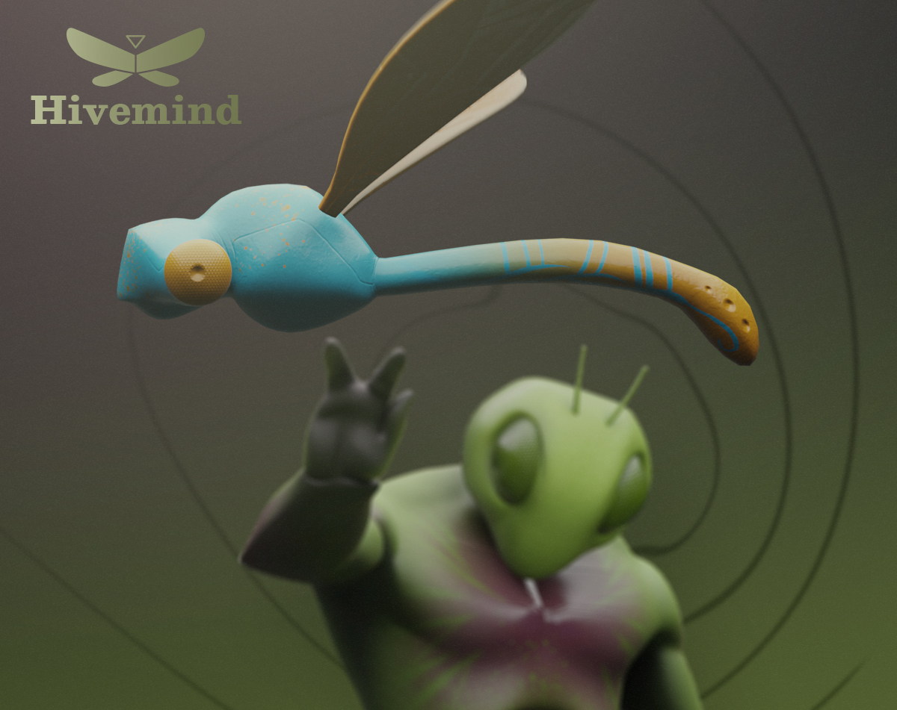

# Hivemind
 Source code of the game presented in the Gameoff 2021

# Hivemind - Gameoff2021
A game made for the 2021 Github GameOff Jam based on the theme "BUG" using Godot 3.4. 

Check out the game at  [https://raformatico.itch.io/hivemind](https://raformatico.itch.io/hivemind)

## Credits

[Victor]() : Music

[Fran Arroyo](https://www.franarroyo.com/) : Art and Design

Juanjo Ramos and [Raformatico](https://youtube.com/c/raformatico): Code

## Licenses

All code is licensed under MIT License

All graphical and audio assets are licensed under a Creative Commons Attribution-NonCommercial-NoDerivatives 4.0 International License
